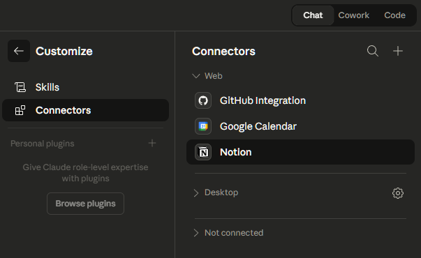

# Setup Guide — Your Life OS

## Prerequisites

- [Claude Code](https://claude.ai/code) (CLI, desktop, or web)
- [Notion](https://notion.so) account (free tier works)
- [Obsidian](https://obsidian.md) installed
- (Optional) Google Calendar for timed reminders

## Step 1: Clone and Personalize

```bash
git clone https://github.com/YOUR_USERNAME/nou-Origin-os.git
cd mind-bridge
```

Open `CLAUDE.md` and fill in the bracketed placeholders:
- `[Your name]` → your name
- `[your-email@gmail.com]` → your email
- `[Your city]` → your city
- `[Your timezone]` → your timezone (e.g. `America/New_York`, `Asia/Tokyo`)
- `[Your current role / focus]` → what you're doing now
- `[Your domain or interests]` → your field

## Step 2: Set Up Notion

1. Create a page called `/dump` — this is your ONE capture file (Brain 02)
2. Create a page called `Master review` — Claude updates this each sync
3. Create a **Tasks** database with these templates:
   - DAILY PLANNER
   - WEEKLY PLANNER (optional)
   - MONTHLY PLANNER (optional)
4. Create folders: `Projects/`, `Life/journal/`, `Life/money-log/`, `Life/step-tracking/`, `Blog pipeline/`
5. Copy your Tasks database ID from the Notion URL and update `CLAUDE.md`:
   - Replace `[YOUR_TASKS_DB_ID]` with your actual database ID
   - Replace `[YOUR_COLLECTION_ID]` with your collection ID

See `notion-templates/` for import files that describe each structure.

### (Optional) Import existing Notion data

If you have an existing Notion workspace:
1. Export: Settings → Export → Markdown & CSV
2. Place the export in a `notion-export-raw/` folder
3. Run Claude Code and paste the classification prompt from the bottom of this file

## Step 3: Set Up Obsidian

1. Open Obsidian → "Open folder as vault"
2. Point to `obsidian-vault/` (or copy its contents to your cloud sync folder)
3. Recommended plugins: Templater, Dataview, Calendar
4. The vault comes pre-structured with folders and templates — customize as needed

## Step 4: Connect Google Calendar (Optional)


1. Update `CLAUDE.md` with your calendar email and timezone
2. If using secondary calendars, add their IDs in the Calendar Conflict Check section
3. Configure Claude's Google Calendar MCP server for direct event creation

Without Google Calendar connected, Claude will tell you what events to create manually.

## Step 5: Run Your First Sync

Pick any method from the [Usage Guide](usage-guide.md). The simplest:

```
cd mind-bridge/
claude
```

Then type:
```
run morning brief
```

If you don't have Notion MCP connected, paste your dump content:
```
run morning brief

Here is my dump:
#todo set up Life OS
#feel excited to get organized
```

## Step 6: Automate (Optional)

See the [Usage Guide](usage-guide.md) for:
- Cowork Scheduler setup (3x daily automated syncs)
- Manual runner method (works anywhere)

---

## Appendix: Notion Export Classification Prompt

Use this to import an existing Notion export into the OS structure:

```
Read CLAUDE.md first. Then:

1. Recursively read everything in notion-export-raw/
2. For each file, classify as: journal/feel/life, task/todo, project/update,
   knowledge/concept/research/book, english/vocab/mistake, money/finance,
   schedule/deadline, blog/idea/output, misc/unclear
3. Route to:
   - Obsidian vault → knowledge, research, english, blog drafts
   - Notion import files → tasks, journal, projects, calendar, money
   - Archive → misc, unclear, duplicates
4. Write a report at docs/archive-report.md
```
