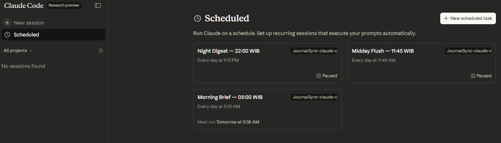
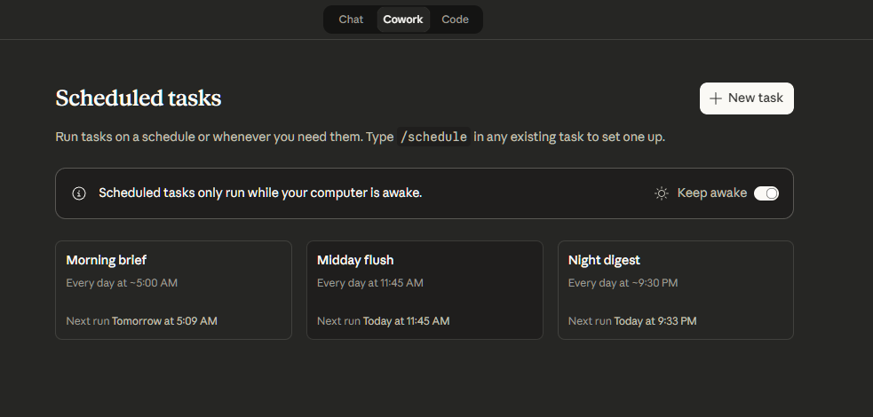
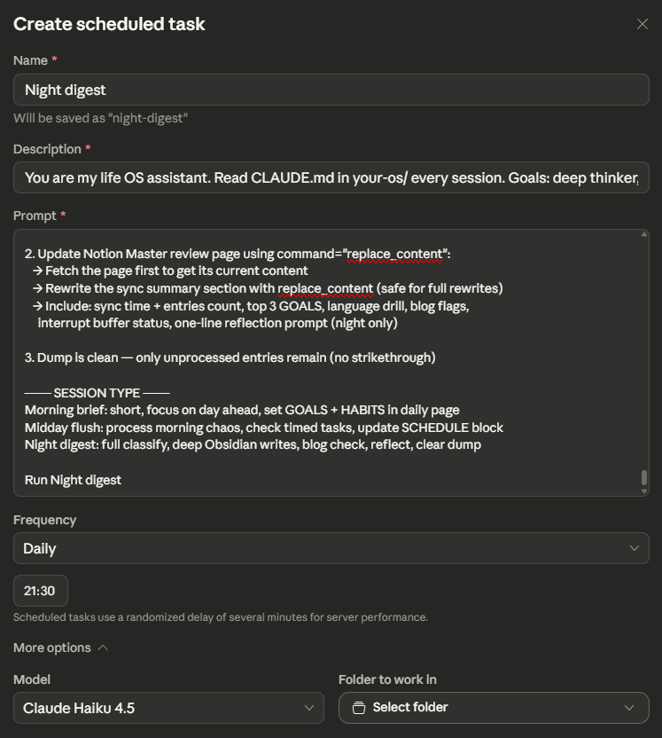

# Usage Guide — Running Syncs

There are several ways to run your Life OS syncs. Pick what works for your setup.


## Quick Reference

| Method | Needs local repo? | Needs MCP? | Automation? |
|--------|-------------------|------------|-------------|
| CLI | Yes | Optional | No |
| Web (private repo) | No (cloud repo) | Optional | Yes (scheduled) |
| Cowork desktop | Yes | Yes | Yes (scheduled) |
| Manual | No | No | No |
---

## Method 1: Claude Code CLI (Desktop)

If you have Claude Code installed locally:

```bash
cd your-os/
claude
```

Then type one of:
```
run morning brief
run midday flush
run night digest
```

Claude reads `CLAUDE.md` automatically (it's in the project root), then executes the sync. Paste your dump content when prompted, or let Claude read it directly from Notion if you have the Notion MCP server connected.

---

## Method 2: Claude Code Web (claude.ai/code)

1. Go to [claude.ai/code/scheduled](https://claude.ai/code/scheduled )
2. Open or create a session pointed at your repo

4. Type the sync command:
   ```
   run morning brief
   ```



5. If Claude doesn't have direct Notion access, paste your dump content:
   ```
   run morning brief

   Here is my dump:
   #todo finish project proposal
   #sched meeting with advisor March 29 10AM
   #feel tired but focused today
   ```

**Note:** The web version has full tool access (Notion MCP, Google Calendar MCP) if configured in your Claude Code settings.

---

## Method 3: Cowork Scheduler (Desktop)

Use Claude's Cowork feature with the sync prompt from `.claude/cowork-sync-prompt.md`.

### Setup

1. Open Claude app desktop)
2. Go to Cowork

4. Paste the contents of `.claude/cowork-sync-prompt.md` as the cowork prompt new session

6. Set global instructions (or put it on the description schedules)
7. set up automated runs

### 3x Daily Schedule

| Sync | Suggested Time | Notes |
|------|---------------|-------|
| Morning brief | 7:00 AM | Short — goals + schedule |
| Midday flush | 1:00 PM | Quick — process morning entries |
| Night digest | 10:00 PM | Thorough — full classify + reflect |

Adjust times to match your routine. Add these as recurring events in Google Calendar too, so you get reminders.

### Known limitation

The Cowork Scheduler on desktop currently has a bug where it fails to read local `.md` files (see [Known Bugs](known-bugs.md#cowork-scheduler-desktop-bug)). Workaround: use the web version, or use the manual method below.

---

## Method 4: Manual Runner (Copy-Paste)

Works anywhere Claude is available — no tools required.

1. Open any Claude session (claude.ai, Claude Code, API)
2. Paste this prompt:

```
Read CLAUDE.md from my your-os project. Then run [morning brief / midday flush / night digest].

Here is my Notion dump content:

[paste your dump entries here]
```

3. Claude will classify and tell you what goes where
4. Without MCP connections, Claude can't write directly to Notion/Calendar — it will give you the organized output to paste manually

This is the most portable method. No setup required.

---


## How This System Runs (Recommended Setup)

| Sync | Method | Mode | Why |
|------|--------|------|-----|
| Morning brief | Claude Code web (private repo) | Automatic — scheduled, runs unattended | Short sync, low token cost, fires before your day starts |
| Midday flush | Cowork desktop | Semi-automatic — scheduler triggers, you review output | Quick pass, needs your context to catch conflicts |
| Night digest | Cowork desktop | Semi-automatic — scheduler triggers, you review output | Full classify — you should read and approve the reflection |

> **Private repo note:** Morning brief runs on Claude Code web against your private repo. Keep your repo private — it contains your Notion IDs, calendar IDs, and personal routing rules.

---

## Token Cost Per Sync

Knowing the approximate cost helps you plan session budgets and avoid hitting context limits mid-sync.

| Sync | Typical token cost | Notes |
|------|-------------------|-------|
| Morning brief | ~2–3% of session | No deep Obsidian writes — fast |
| Midday flush | ~2–3% of session | Interrupts held, minimal routing |
| Night digest | ~8–10% of session | Full classify + Obsidian writes |
| Heavy night (large dump + many #know entries) | ~10%+ | Batch large Obsidian writes across sessions if needed |

**Tips to keep costs low:**
- Start morning brief early — the longer you wait, the larger the dump grows
- Use `#interrupt` during the day to defer processing to 22:00 in one batch rather than ad-hoc
- Avoid adding every new tool or tag to the system — complexity compounds token cost
- If a night digest is running long, finish Notion writes first, then run Obsidian writes as a separate session

---


